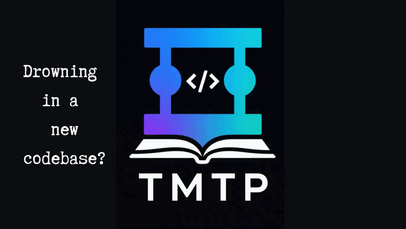

# TMTP

## Contributors

- [Steve Michira](https://www.linkedin.com/in/steve-michira-97a280339/) — [Code the Giant](https://codethegiant.vercel.app/)

### Understand the project before you modify it.

TMTP-**Teach Me This Project**-is a VS Code extension that helps developers find their way through an unfamiliar codebase. It analyzes the repository first, shows where to begin, and then uses AI to explain the project through its real files and architectural decisions.



[Watch the full TMTP demo on YouTube](https://youtu.be/imx2xqSUQhk?si=glFkzc2FYiOqxTfT)

<!-- [Get started](#installation) · [See how it works](#how-tmtp-works) · [View the roadmap](#roadmap) · [Report an issue](https://github.com/UnaStaziaBo/TMTP-project-aware-AI-mentor-for-developers/issues) -->

> TMTP is an early public release. The deterministic analysis, project graph, guided lessons, practice flows, and progress tracking described below are implemented today. Current limitations are documented openly.


## The problem

You cloned a repository. It builds. The tests pass. Now comes the harder question:

> **Where do I even start?**

A file tree tells you what exists, but not what matters. A dependency graph shows connections, but not what to learn first. Search can find a symbol, but it cannot explain why the project is structured that way.

Coding assistants are useful once you know what to ask. In an unfamiliar codebase, forming the right question is often the first obstacle.

TMTP is built for that moment. It helps you understand the project before asking you to change it.

## Why TMTP

Most AI coding workflows begin with a prompt. TMTP begins with the repository.

It first runs a deterministic local analysis to discover project structure, technologies, important files, and supported import relationships. That analysis decides what is present and where the learning journey should begin. AI is introduced only when you request an explanation or practice exercise.

This separation matters:

- **The scanner establishes evidence.** Files, signals, rankings, and graph relationships do not come from an AI guess.
- **AI explains a constrained context.** A lesson is grounded in one real file, its source, detected language, and the reasons it was recommended.
- **Code remains the source of truth.** TMTP teaches through the repository you opened rather than replacing it with a generic tutorial.
- **Understanding comes before coding.** TMTP is a learning and onboarding companion, not a general-purpose code generator or chat interface.

## How TMTP works

```text
Scan
  ↓
Understand
  ↓
Visualize
  ↓
Learn
  ↓
Practice
  ↓
Track progress
```

1. **Scan** — inspect the open workspace locally through a deterministic analysis pipeline.
2. **Understand** — identify languages, frameworks, infrastructure, dependencies, and likely starting files.
3. **Visualize** — explore verified local imports and a separately labelled recommended learning path.
4. **Learn** — generate guided explanations for important files, grounded in their real source.
5. **Practice** — work through architectural scenarios about where changes and responsibilities belong.
6. **Track progress** — retain explained, read, practised, and mastered file states across sessions.

## Project Overview

**The problem:** An unfamiliar repository does not provide a concise map of its technology and structure.

**What TMTP does:** The Project Overview streams six analysis stages and summarizes files, folders, manifests, detected languages, frameworks, infrastructure, dependencies, and top file types. Detection results include confidence and the repository signals behind them.

**Why it matters:** You get an evidence-based first orientation without sending the repository to an AI service.

Detection is heuristic rather than a full semantic build-system analysis. See [supported analysis](#supported-analysis) for the current scope.

## Where Should I Start?

**The problem:** Real projects often have several meaningful entry points, especially monorepos and applications with separate frontend, backend, CLI, or service layers.

**What TMTP does:** It ranks source files using deterministic signals such as executable entry points, framework bootstraps, conventional filenames, import centrality, reverse references, and orchestration behavior. Every recommendation includes the reasons it received its position.

**Why it matters:** Instead of opening files at random, you begin with a reviewable learning order derived from the repository itself. No AI is involved in this ranking.

## Interactive Project Graph

**The problem:** A directory tree does not explain the responsibilities and interactions that make up a project architecture.

**What TMTP does:** Project Graph opens directly into an AI-interpreted Architecture Graph grounded in verified scanner evidence. It shows a synthetic project root, architecture areas, their evidence-backed interactions, and canonical files on demand. The Architecture Navigator provides a compact topology, current-viewport indicator, area navigation, selected file-to-area orientation, and real file-level learning progress.

Search, pan, zoom, Fit to Screen, relationship inspection, area expansion, canonical-file selection, and progress remain available directly in this graph. Dependency/import detection remains part of the deterministic scanner evidence pipeline, but the former Dependencies graph is not user-facing.

**Why it matters:** You can orient yourself in the systems and responsibilities of an unfamiliar codebase without navigating a separate graph mode.

Project Graph needs an AI provider configuration to generate an architecture model. TMTP reuses a compatible cached architecture model when available; without a configured API key it explains that configuration is required. Scanner analysis itself remains local and does not require an API key.

## Guided Project Tour

**The problem:** Knowing that a file is important does not explain its responsibility or how its code expresses the project architecture.

**What TMTP does:** The tour follows the same ranked starting files one at a time. For each requested file, it provides:

1. **Project Context** — what the file is responsible for, where it fits, and why it exists.
2. **Key Constructs** — a focused set of source snippets, each explained through three lenses:
   - its role in this project;
   - the language construct being used;
   - why it matters architecturally.

The lesson receives the real file content, the scanner-detected primary language, and the deterministic reasons the file was recommended. Lessons are generated on demand and cached per workspace so reopening one does not repeat the same request.

**Why it matters:** The repository becomes the learning material. You learn language and architecture in the context where they are actually used.

AI explanations can still be imperfect. TMTP validates the response structure and grounds the request in real source, but generated prose should be reviewed against the code.

## In-editor AI Commentary

**The problem:** Explanations lose value when they are separated from the exact code they describe.

**What TMTP does:** Generating or reopening a lesson opens the source beside TMTP and anchors collapsible native VS Code comment threads to matched snippets. Each thread contains the project role, language explanation, and architectural rationale. Read and unread state persists, while editing the source removes that file's commentary so stale annotations are not left behind.

**Why it matters:** You can study the explanation at the relevant lines without modifying the source file or leaving the editor.

## Learning Readiness Check

**The problem:** A tour cannot know which parts felt clear and which need reinforcement.

**What TMTP does:** After the Guided Tour, you rate your confidence for each file you explored. TMTP uses those ratings to weight the next practice set toward files you want to understand better.

**Why it matters:** Practice responds to your own sense of readiness instead of treating every learning stop equally.

This is a file-confidence check, not a formal language proficiency test or automated knowledge-gap assessment.

## Day 1 Practice

**The problem:** Reading an explanation does not prove you know where to begin when a real task arrives.

**What TMTP does:** Day 1 Practice presents realistic multiple-choice scenarios about file responsibilities and architectural boundaries. Tour-wide practice emphasizes lower-confidence files. Focused practice is available for an individual file and tests what belongs there, what it delegates, and when a neighboring file is the better answer.

The planner fixes the files, answer choices, correct answer, order, and difficulty before AI writes the scenario and feedback. AI cannot replace those deterministic choices in its response.

**Why it matters:** You practise navigating the architecture rather than memorizing filenames or syntax trivia.

## Progress Tracking

**The problem:** Onboarding is rarely completed in one sitting.

**What TMTP does:** TMTP keeps lightweight per-workspace learning state for files that are:

- not visited;
- explained, including read commentary progress;
- practised;
- mastered or explicitly marked as learned.

The Activity Bar Learning Home and Project Graph surface that state when you return.

**Why it matters:** You can resume the learning journey instead of reconstructing what you already explored.

Progress is file-level and intentionally simple. TMTP does not yet maintain a broader developer skills profile.

## Privacy and data handling

TMTP separates local analysis from optional AI generation.

### What stays local

- Repository scanning and filesystem inventory.
- Language, framework, infrastructure, and dependency detection.
- Starting-file ranking and its evidence.
- Project import graph construction.
- Learning progress and cached generated results in VS Code extension storage.
- Your API key, stored through VS Code SecretStorage rather than `settings.json`.

### What is sent to OpenAI

AI is used only when you test the connection, request a file explanation, or request practice content.

- A file lesson sends the selected file's path, full content, detected primary language, and starting-file reasons.
- Practice generation sends the relevant file names and the available lesson titles/responsibility summaries, together with the deterministic scenario plan.
- A connection test sends an authenticated request to OpenAI's models endpoint.

TMTP currently connects directly from the extension host to the API provider you select: OpenAI, Anthropic Claude, or Google Gemini. It does not include a TMTP-operated proxy or backend in this repository. Your use is subject to the selected provider's account terms, policies, and API charges.

## Supported analysis

Current detector coverage is:

| Area | Supported signals |
|---|---|
| Languages | Python, TypeScript, Java, Go, Rust |
| Frameworks | FastAPI, React, NestJS, Django, Spring Boot |
| Infrastructure | Docker, Docker Compose, GitHub Actions, Kubernetes, Terraform, Dev Containers, Nginx |
| Dependencies | Pydantic, SQLAlchemy, React Router, Axios, JWT, Django REST Framework, Spring Security |
| Import relationships | TypeScript/JavaScript relative imports and resolvable project-local Python imports |

Detection is based on repository signals and confidence scores. It is designed for orientation, not as a replacement for a package manager, compiler, security scanner, or complete static-analysis system.

## Current limitations

- AI features require your own OpenAI, Anthropic, or Google AI API key and may incur provider charges.
- The model is configurable, but compatibility depends on the selected provider's text-generation API and ability to return JSON.
- Only the first folder in a multi-root VS Code workspace is analyzed.
- Import relationships are currently resolved only for supported TypeScript/JavaScript and Python patterns.
- Technology and dependency detection is heuristic rather than manifest-semantic.
- The graph may be sparse for unsupported or ambiguous import syntax.
- TMTP is not a general-purpose chat assistant or code generator.
- Learning progress is file-level; developer profiles, concept-level knowledge gaps, and adaptive curricula are future work.
- AI lessons are structurally validated and source-grounded, but generated explanations can still contain mistakes.

## Installation

TMTP currently targets VS Code 1.85 or newer.

### Install the development release

Until the public Marketplace listing is available:

1. Download or build the `tmtp-0.1.0.vsix` package.
2. In VS Code, open the Extensions view.
3. Open the **Views and More Actions** menu (`…`).
4. Select **Install from VSIX…** and choose the package.
5. Open a project folder.
6. Select the TMTP icon in the Activity Bar.
7. Open the Project Graph, Project Overview, or **Where Should I Start?** view.
8. Choose OpenAI, Anthropic Claude, or Google Gemini and configure its API key to use Project Graph, the Guided Tour, or practice features.
<!-- 
### Build from source

Prerequisites: Node.js and pnpm.

```bash
pnpm install
pnpm build
```

<!-- git clone https://github.com/UnaStaziaBo/TMTP-project-aware-AI-mentor-for-developers.git -->

Open the repository in VS Code and press `F5` with the **Run TMTP Extension** launch configuration. The Extension Development Host will open with the current build.

## Development

The repository is a pnpm workspace:

```text
apps/
  vscode-extension/   VS Code integration and learning interface
packages/
  scanner/            Deterministic repository analysis
  ai/                 AI provider, prompts, and response validation
  shared/             Minimal shared package for future cross-package contracts
examples/             Golden projects used by integration tests
docs/                 Architecture, roadmap, and contributor guidance
```

Useful commands:

```bash
pnpm build
pnpm --filter @tmpt/scanner test:integration
pnpm --filter @tmpt/ai test:integration
pnpm --filter tmtp test:integration
```

The current source contains 32 scanner, 28 AI, and 29 extension test cases. Network calls in the AI tests are mocked; no real API key is required.

For package boundaries and design decisions, see [Architecture](docs/architecture.md). For the local development workflow, see [Development Guide](docs/development.md). -->

## Roadmap

Future work is focused on:

- richer code relationships beyond supported local imports;
- concept usage detection grounded in source;
- a developer profile that can represent goals and experience;
- concept-level knowledge-gap identification;
- adaptive learning recommendations and longer-term learning paths;
- additional AI providers and provider-specific configuration guidance;
- more complete automated Extension Host and release-installation testing.

See the [project roadmap](docs/roadmap.md) for the longer-term architecture direction. Roadmap items are plans, not current capabilities.

## License

No open-source license file has been committed yet. Until the project owner selects and adds a license, the source is publicly visible but no open-source usage rights should be assumed.

## Project links

- [Source repository](https://github.com/UnaStaziaBo/TMTP-project-aware-AI-mentor-for-developers)
<!-- - [Issue tracker](https://github.com/UnaStaziaBo/TMTP-project-aware-AI-mentor-for-developers/issues) -->
- [Changelog](CHANGELOG.md)
